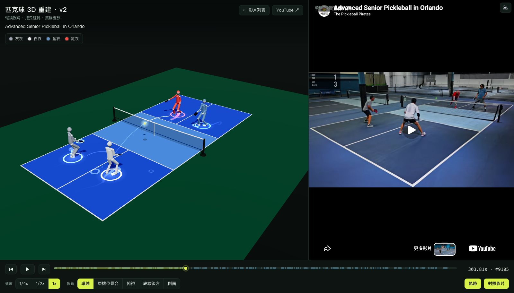
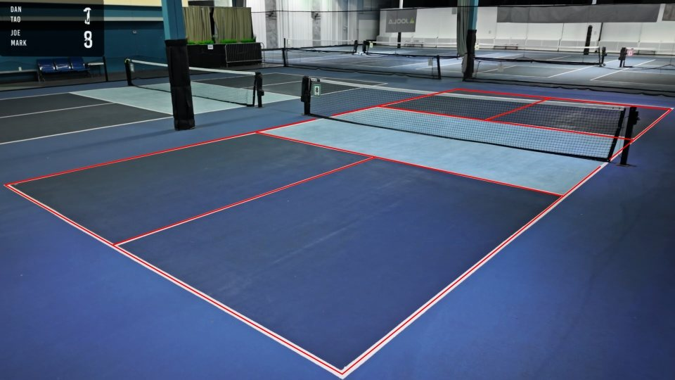
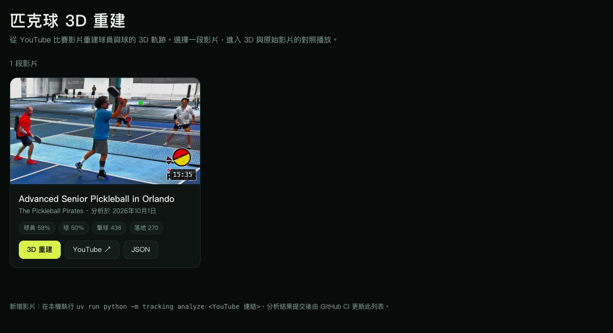
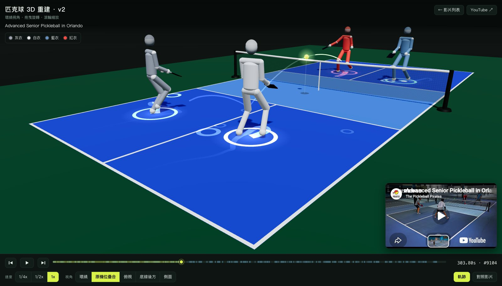
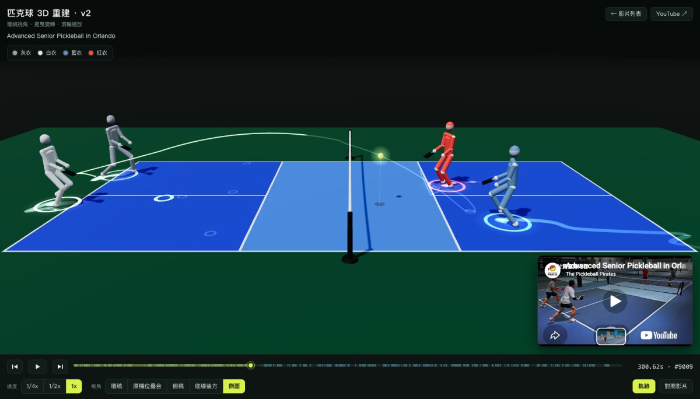
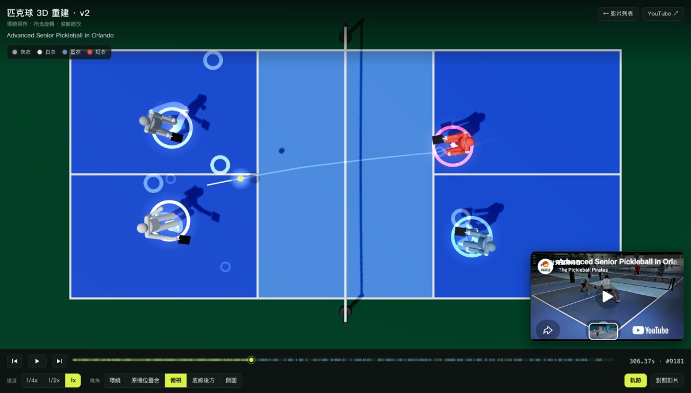
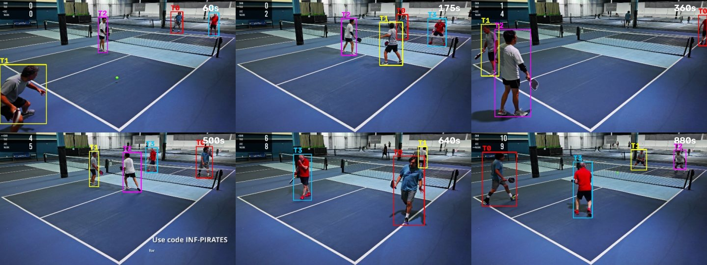
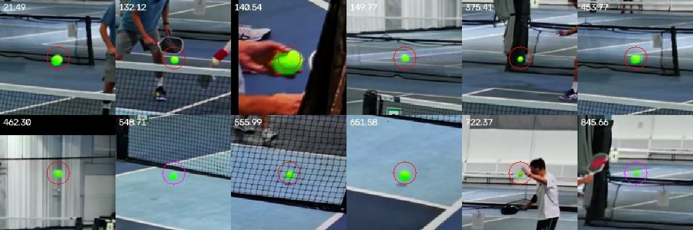

# 匹克球 3D 重建 · Pickleball 3D Reconstruction

Turn a YouTube pickleball doubles video into 3D: player positions, the ball's flight,
hits and bounces. Then replay it in an interactive Three.js court, side by side with the
original video.

**Site:** https://changtimwu.github.io/ballvideo3dreconstruction/



## How it fits together

```
your Mac                                     GitHub
─────────────────────────────────            ───────────────────────────────────────
python -m tracking analyze <youtube-url>     push → Actions (.github/workflows/pages.yml)
  download (yt-dlp) → work/<id>/               tools/build_site.py
  calibrate → detect → … → ball3d               site/*  +  videos/*/  →  _site/
  → videos/<id>/tracking_data.json              writes videos.json (the video list)
  → git commit + push ───────────────────────►  deploy to GitHub Pages

browser: index.html (video list) ─► viewer.html?v=<id>
         3D reconstruction  ⇄  YouTube player (the master clock)
```

- **Analysis runs locally.** It takes ~45 min per 15-min video on an M1 Max GPU, and
  only its results are committed. The videos themselves aren't: they stay in `work/`
  (gitignored), and the site plays them from YouTube.
- **CI only assembles the static site.** It copies the pages, publishes each video's
  data as `data/<id>.json`, and generates `videos.json` from the `meta.json` files.

| Path | What it is |
| --- | --- |
| `tracking/` | The analysis pipeline and CLI (§2, §5). |
| `videos/<id>/` | Per analysed video: `tracking_data.json`, `camera.json`, `meta.json`. Committed. |
| `site/index.html` | The video list. Cards link to the viewer. |
| `site/viewer.html` | The 3D viewer plus the YouTube player. One file; Three.js and Tailwind come from CDNs. |
| `tools/build_site.py` | Builds `_site/` and `videos.json` (CI; standard library only). |
| `prompts.md` | The original viewer spec. |

## 1. Setup

```bash
brew install yt-dlp ffmpeg uv     # yt-dlp downloads; ffmpeg merges video and audio
uv sync                           # Python 3.12 + PyTorch/Ultralytics (~1 GB on first run)
```

## 2. Analyse a video

```bash
uv run python -m tracking analyze "https://www.youtube.com/watch?v=cRRLvhKbPXM"
```

**What the command does:**
1. Reads the video's metadata and downloads it to `work/<id>/video.mp4`: H.264 up to
   1080p, plus AAC audio.
2. Runs the stages in §5. Any stage whose output already exists is skipped, so a rerun
   resumes where it stopped; `--force` reruns everything.
3. Writes `videos/<id>/` (`tracking_data.json`, `camera.json`, `meta.json` with the
   title, channel, duration and tracking stats).
4. Commits that folder and pushes. CI then republishes the site, and the video appears
   in the list.

**Options:**
- `--no-push`: commit but don't push.
- `--no-commit`: just write the files.
- `--no-gui`: never open the calibration window; fail instead.

**Court calibration** is automatic. It finds the court lines on a median "empty court"
frame. If that doesn't validate, a window opens on that frame: click the named court
points it asks for (`s` skips a point that isn't visible, `u` undoes, Enter finishes once
4 or more are picked).



*Automatic calibration on the reference video: the court model, in red, snapped onto the
painted lines of the median frame. The players have averaged away.*

**What footage works:**
- A **fixed camera** that sees the court, typically from behind a baseline. Videos with
  camera cuts or panning aren't supported; the calibration's drift check warns about them.
- **Doubles** (4 players).
- A **yellow/green ball.**

## 2b. Find more videos (`scout`)

Deciding by eye whether a video fits the pipeline is slow. `scout` screens candidates
automatically and keeps a ranked list, so a human only confirms the top ones:

```bash
uv run python -m tracking scout --channel "https://www.youtube.com/@ThePickleballPirates/videos" --limit 30
uv run python -m tracking scout --search "pickleball 4.5 doubles full game" --limit 30
uv run python -m tracking scout --report          # ranked list in the terminal
uv run python -m tracking scout --review          # local page: contact sheets + accept / reject
uv run python -m tracking scout --analyze-top 3   # analyse the best accepted videos (+ --include-auto)
```

Each video goes through the stages, cheapest first, and stops at the first failed gate:

| Stage | Cost | Measures |
| --- | --- | --- |
| Metadata | ~1 s | public, embeddable, not live, 5–60 min, ≥ 720p |
| Storyboard | ~3 s, ~1 MB | YouTube's 320×180 preview frames every ~10 s, compared with the median view (ORB homography, plus an unchanged-pixel fallback for dark or occluded frames): share of time on the fixed view, cuts per minute, graphics and caption share |
| Frames | ~60 MB | 24 frames from a 480p copy: does `tracking.calibrate` find the court, how many players stand on it, how often is the court visible |
| Audio | ~15 MB | share of time with music (sustained spectral peaks); paddle-pop rate (reported only) |

**Where results go:**
- **Registry:** every result goes to `scout/candidates.json` (committed): measurements,
  gates, score, and the automatic and human decisions. Videos are never screened twice.
- **Re-scoring:** `--rescore` re-applies the thresholds to the stored measurements
  without re-downloading.
- **Seed set:** `--seed-check` compares the thresholds with the hand labels in
  `scout/seed.json`.

**First results:**
- **Pro-tour broadcasts:** all 10 rejected. They spend 43–69% of the time on the main
  view, cut 1.2–4 times a minute, or run over an hour.
- **The reference channel's games:** all pass the storyboard stage, at 95–100% fixed
  view and almost no cuts.
- **The reference video, end to end:** scores 94/100 (auto-pass).

**If YouTube refuses media downloads** (`HTTP Error 403`), which happens after bursts of
requests, the affected videos are marked `incomplete`. `--retry-incomplete` resumes
them later. Storyboards and metadata keep working.

## 3. The site

- **`index.html`** lists the analysed videos.
- **`viewer.html?v=<id>`** plays one video: the 3D reconstruction next to the YouTube
  player.



The transport bar drives the YouTube player (play/pause, seek, frame step, ¼×/½×/1×),
and the 3D scene follows the player's clock. 對照影片 shrinks the video to a mini player:
YouTube players have to stay at least 200×200 px to keep playing.

**Camera presets.** 原機位疊合 uses the calibrated camera, so the 3D court lines up with the
real footage (here with the video collapsed to the mini player). 側面 and 俯視 show the ball's
arc over the net and the players' recent footwork (軌跡).

| 原機位疊合 (camera-matched) | 側面 (side) | 俯視 (top-down) |
| --- | --- | --- |
|  |  |  |

**Local preview** (no Range-capable server needed, since the video comes from YouTube):

```bash
python3 tools/build_site.py && python3 -m http.server -d _site 8080
```

### Controls

| Control | Action |
| --- | --- |
| Space | Play / pause |
| ← / → | Step one video frame |
| `1/4x` `1/2x` `1x` | Playback speed |
| `1`–`5` | Camera: 環繞 / 原機位疊合 / 俯視 / 底線後方 / 側面 |
| `T` | Toggle player trails (軌跡) |
| `V` | Toggle the video panel (對照影片) |
| Drag / scroll | Orbit / zoom (dragging from any preset switches to 環繞) |

**Deep links** set the starting view, e.g.
`viewer.html?v=cRRLvhKbPXM#cam=broadcast&t=900&panel=0&trails=0`.

## 4. Tracking data format (`tracking_data.json`)

In short:

- **Units:** metres.
- **Court coordinates:**
  - The origin is the centre of the net, on the floor.
  - `+x` points toward the far baseline. The near baseline is at `x = -6.705`.
  - `+y` is the left side, as seen from behind the near baseline.
  - `z` is up.
- **`frames[]`:** each frame holds `t`, plus per-player `[x, y]` floor positions and a ball
  `[x, y, z]`. Either can be `null` when missing.
- **Optional `poses`:** COCO-17 joints per player. Without them, the figures are posed
  procedurally from footwork and hit timing.
- **Optional `events[]`:** `hit` and `bounce` events. If they're absent, they're
  auto-detected from the ball path.
- **Optional `camera`:** overrides the built-in calibration.
- **Player labels and colours** come from `players[]`. The pipeline names players by
  measured shirt colour (灰衣 / 白衣 / 紅衣 / 藍衣), not 近場 / 遠場, because the teams
  switch ends mid-match.
- **`video_offset`:** maps data time to video time (`video_time = t + video_offset`).

## 5. Pipeline stages (`tracking/`)

`tracking analyze` runs these with per-video paths in `work/<id>/`. Each stage is also a
module you can run on its own (`uv run python -m tracking.<stage> --help`).

| Stage | What it does |
| --- | --- |
| `calibrate` | Builds an empty-court median frame, detects line candidates (white top-hat mask, Hough lines, two direction families), and scores every line-pair × line-pair × court-labelling homography by whether the projected court model lands on paint with floor either side of it. The best one is turned into a camera (`solvePnP` with a focal-length sweep), snapped to the actual lines (near-half points first; far ones only where they agree), validated, and drift-checked every 30 s. Falls back to clicking court points. On the reference video it matches the hand calibration within 2 cm and 0.2°. |
| `detect` | Runs YOLO11-pose at ~30 fps (every 2nd frame of a 60 fps video). Keeps people whose feet project onto this court (±2 m), samples each one's shirt colour, and scores whether the court is visible in the frame. |
| `appearance` | Samples the median colour of keypoint-anchored regions per detection: hair, torso, shorts and each elbow. Needed because the near pair wear near-identical light shirts. |
| `track` | See below. |
| `export` | Pairs players into teams (the pair that shares a half), names them by shirt colour, and writes the viewer JSON. Long gaps stay `null`, and the viewer hides the player there. |
| `overlay` | Draws the exported positions back onto the video, to check alignment and identities. |
| `ball_detect` | Every frame: neon-green colour mask, minus a learned static mask (net-post sticker, logos), keeping only moving blobs. Records size, shape, hue/saturation and distance to the nearest ankle. |
| `ball_track` | Links candidates into flight tracks (seed by consistent velocity, extend with a quadratic prediction, allow short occlusion gaps). Keeps tracks that are ball-coloured (hue ≥ 40, sat ≥ 165; this rejects shoe stripes and a paddle grip), moving, and whose size-implied depth puts them over this court (rejects neighbouring-court balls). Then picks one track per frame. |
| `ball3d` | Lifts the 2D track to 3D. Between contacts the ball is ballistic, so each flight segment is 6 unknowns (start position, velocity) fitted to tens of observations through the calibrated camera, initialised from the ball's pixel size. Tracks are split at kinks (hits/bounces) wherever one parabola doesn't fit. Then each rally's segments are refit jointly with air drag (a = g − k\|v\|v, k = 0.04 /m) and soft constraints: consecutive segments meet, bounces lie on the floor. Boundaries become bounce events (on the floor, vertical velocity flips) or hit events (credited to the nearest player). |
| `ball_check` | Physical sanity checks: how well segments join, net-crossing heights, bounce positions, contact heights. |
| `ball_qa` | Crops around random tracked ball positions, to check precision. |
| `identity_frames` | Tiles frames with per-tracker boxes at chosen timestamps. This is the check that catches identity swaps. |

**How `track` assigns identities:**
1. Drop duplicate boxes on one person, and set aside people standing within 0.7 m of
   someone else.
2. Link the rest into tracklets by floor-position continuity, and merge unambiguous
   continuations.
3. **Teams by court side:** the red player's shirt is unmistakable, so his half over time
   tells every tracklet which team it belongs to. Partners share a half, and the ends
   switch only once.
4. **Split tracklets** where the person's appearance flips. The motion linker sometimes
   swaps two players during a crossing.
5. **Who's who within a team** comes from the multi-region appearance. Tracklets that
   overlap in time must be different people, which makes it a two-colouring problem; each
   connected group is oriented by its length-weighted evidence.
6. Fill the set-aside crowded detections back in, place feet (ankles, or hips at each
   player's measured hip height when feet are cut off), reject outliers, fill short gaps,
   and smooth at 2.5 Hz.



*`tracking.identity_frames`: each tracker identity (T0–T3) has to stay on the same person.
The bottom row is after the teams switch ends.*

Checked by eye at 12 timestamps across the match: identities are correct in all of them,
including after the end switch. 61% of frames have all four players. The rest are mostly
players outside the camera's view, which stay `null`.



*`tracking.ball_qa`: random crops around tracked ball positions. A red ring means
detected, magenta means interpolated across a short occlusion.*

**2D ball result:**
- **Coverage:** the ball is tracked in 58% of all frames, 54% directly observed and the
  rest interpolated across short gaps. The median flight track is 26 observations.
- **Precision:** checked by eye on 42 random crops, 41 are the ball; the other is an
  interpolated point behind a player's head.
- **What the untracked frames are:** in sampled frames without a track, the ball was out
  of play (between points, in a hand, or lying still).

**3D ball result (`ball_check`):**
- 1,091 flight segments, 277 bounces and 440 hits.
- The ball is in 50% of exported frames.
- Reprojection error: median 1.3 px.
- Consecutive segments meet: median gap 10 cm.
- Contact height: median 0.91 m.
- Bounces: 90% land within 0.5 m of the court.
- Net crossings: 92% clear the net. Most of the rest are real: balls rolled under the net
  between points, or balls into the net.

**Video quirks the pipeline handles:**
- **A full-screen ad at ~312.5–316.4 s** ("Wear Eye Protection!"). It is detected by
  checking whether the court lines are where the camera says they should be. Players are
  `null` there.
- **The teams switch ends between 7:30 and 10:20.** Identity comes from shirt colour, not
  court side.
- **Near players often step out of the bottom/left edge of the frame.** These become gaps.
- **An animated graphic ball flies at the camera just before the ad** (~310.9–311.5 s).
  It's correctly not tracked.

The numbers above are for the reference video (cRRLvhKbPXM).
